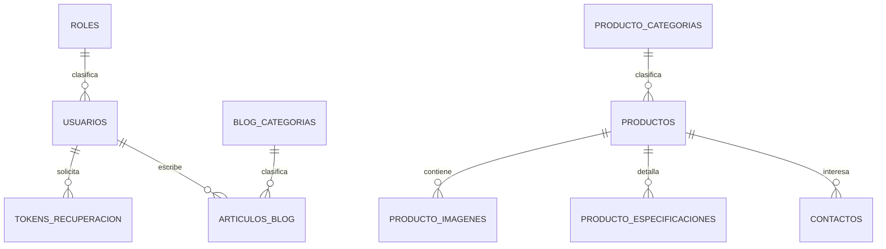

# Plan de proyecto y arquitectura de datos — Technoliner

**Versión:** 1.2

**Fecha:** 2026-08-13

**Estado:** alcance funcional y decisiones de negocio consolidadas

**Stack objetivo:** PHP 8.4, CodeIgniter 4.7.4+, MariaDB/MySQL y Resend Email API

## 1. Objetivo

Evolucionar el sitio actual de Technoliner hacia un aplicativo administrable que permita:

- autenticar usuarios administradores;
- crear y editar artículos del blog;
- publicar o despublicar artículos;
- administrar categorías y productos;
- activar o inactivar productos;
- recibir y guardar formularios de contacto;
- enviar inmediatamente un email de aviso a un destinatario fijo cuando se registre un contacto.

El alcance se mantendrá deliberadamente sencillo. No se construirá un CRM ni un sistema de asignación o seguimiento comercial.

## 2. Alcance de la primera versión

### Incluido

- Panel administrativo protegido por login.
- Administración básica de usuarios.
- Recuperación de contraseña.
- Blog administrable.
- Categorías del blog.
- Catálogo administrable.
- Categorías, imágenes y especificaciones de productos.
- Estado activo/inactivo para productos.
- Formulario público de contacto.
- Guardado de cada contacto en la base de datos.
- Email inmediato con los datos del contacto a una dirección fija definida en el proyecto.
- SEO básico para blog y productos.
- Migraciones, seeders y pruebas.

### Fuera de alcance

- Operadores comerciales.
- Asignación de contactos.
- Estados de seguimiento comercial.
- Notas, llamadas o actividades sobre contactos.
- Bandeja de salida o cola de correos.
- Reintentos automáticos de correo.
- Suscripciones de notificación.
- Carrito, pagos, inventario, pedidos o facturación.
- Registro público de usuarios.
- Comentarios públicos en el blog.
- Flujos de aprobación editorial.
- Multiempresa o múltiples idiomas.

## 3. Decisiones técnicas base

1. La base local se llamará `technoliner_local`.
2. Se usará MariaDB/MySQL con InnoDB y `utf8mb4_unicode_ci`.
3. Los identificadores serán `BIGINT UNSIGNED AUTO_INCREMENT`.
4. Las fechas se almacenarán en UTC y se mostrarán usando `America/Bogota`.
5. Sólo existirán usuarios internos; no habrá registro público.
6. El rol inicial será `administrador`.
7. Todos los administradores tendrán acceso al blog, productos y usuarios.
8. Resend será el proveedor inicial de correo transaccional.
9. La API key de Resend estará en `.env` y nunca en Git.
10. El destinatario fijo será Carlos Arturo Olarte González, `gerencia@technoliner.co`.
11. El email se enviará sincrónicamente justo después de guardar el contacto.
12. Si el email falla, el contacto permanecerá guardado y el error se registrará en los logs.
13. No habrá reintento automático en la primera versión.
14. Las acciones que cambian datos usarán POST; nunca enlaces GET para eliminar, publicar o activar.
15. El HTML del editor de artículos y productos se sanitizará antes de guardarse.

### Datos de negocio confirmados

| Dato | Definición |
|---|---|
| Administrador inicial | Carlos Arturo Olarte González |
| Email del administrador | `gerencia@technoliner.co` |
| Destinatario de contactos | Carlos Arturo Olarte González, `gerencia@technoliner.co` |
| Dominio final | `technoliner.co` |
| Proveedor de email | Resend, plan Free |
| Dominio de envío recomendado | `correo.technoliner.co` |
| Remitente técnico | `notificaciones@correo.technoliner.co` |
| Política de datos | Versión 1.0, vigente desde 2026-08-13 |

### Selección del proveedor de email

Se evaluaron tres alternativas gratuitas vigentes:

| Proveedor | Plan gratuito | Integración | Decisión |
|---|---|---|---|
| Resend | 3.000 emails/mes y 100/día | API y SDK oficial para PHP | **Seleccionado** |
| Mailjet | 6.000 emails/mes y 200/día | API y SMTP | Alternativa de respaldo |
| Brevo | 300 emails/día | API y SMTP | No seleccionado; el plan gratuito agrega marca del proveedor |

Resend se selecciona porque el volumen esperado es inferior a 300 emails mensuales, su SDK oficial para PHP simplifica la integración y el envío mediante API HTTPS es independiente del servidor SMTP de Hostinger. Su límite de un dominio es suficiente para `correo.technoliner.co`.

Para habilitarlo se deberán crear en el DNS administrado por Hostinger los registros SPF y DKIM entregados por Resend. Se recomienda añadir DMARC después de verificar el dominio.

## 4. Referencia tomada de Cycloid Talent

### Elementos que sí se tomarán como base

- Separación entre controladores públicos y administrativos.
- Grupo de rutas `/admin` protegido por autenticación.
- Uso de `password_hash()` y `password_verify()`.
- Slugs únicos sin tildes.
- Autor relacionado con cada artículo.
- Guardar primero el contacto y luego enviar el email.
- Uso de un proveedor transaccional con `reply_to` igual al email del visitante.

### Elementos que se mejorarán

- CSRF estará activado desde el comienzo.
- Los cambios de estado no se harán mediante GET.
- Los tokens de recuperación se guardarán como hash.
- Las credenciales nunca estarán escritas en scripts o controladores.
- Las imágenes tendrán validación real de MIME, extensión y tamaño.
- El contenido HTML será sanitizado en el servidor.
- CodeIgniter se actualizará antes de construir los módulos.

## 5. Modelo de datos resumido

Se proponen únicamente diez tablas:



1. `roles`
2. `usuarios`
3. `tokens_recuperacion`
4. `blog_categorias`
5. `articulos_blog`
6. `producto_categorias`
7. `productos`
8. `producto_imagenes`
9. `producto_especificaciones`
10. `contactos`

## 6. Diccionario de datos

### 6.1 `roles`

Catálogo maestro de roles de usuario.

| Campo | Tipo | Nulo | Regla |
|---|---|:---:|---|
| `id` | BIGINT UNSIGNED | No | PK autoincremental |
| `codigo` | VARCHAR(50) | No | Único; inicialmente `administrador` |
| `nombre` | VARCHAR(100) | No | Nombre visible |
| `descripcion` | VARCHAR(255) | Sí | Descripción del rol |
| `activo` | TINYINT(1) | No | Default `1` |
| `created_at` | DATETIME | No | UTC |
| `updated_at` | DATETIME | No | UTC |

Índices:

- `PRIMARY KEY (id)`
- `UNIQUE KEY (codigo)`

Datos semilla:

| codigo | nombre |
|---|---|
| `administrador` | Administrador |

### 6.2 `usuarios`

Usuarios internos autorizados para entrar al panel.

| Campo | Tipo | Nulo | Regla |
|---|---|:---:|---|
| `id` | BIGINT UNSIGNED | No | PK autoincremental |
| `rol_id` | BIGINT UNSIGNED | No | FK a `roles.id`, `ON DELETE RESTRICT` |
| `nombre` | VARCHAR(120) | No | Nombre completo |
| `email` | VARCHAR(190) | No | Único y normalizado a minúsculas |
| `password_hash` | VARCHAR(255) | No | Generado con `PASSWORD_DEFAULT` |
| `activo` | TINYINT(1) | No | Default `1` |
| `ultimo_login_at` | DATETIME | Sí | Último ingreso correcto |
| `intentos_fallidos` | SMALLINT UNSIGNED | No | Default `0` |
| `bloqueado_hasta` | DATETIME | Sí | Bloqueo temporal de login |
| `password_changed_at` | DATETIME | Sí | Último cambio de contraseña |
| `created_at` | DATETIME | No | UTC |
| `updated_at` | DATETIME | No | UTC |

Índices:

- `PRIMARY KEY (id)`
- `UNIQUE KEY (email)`
- `INDEX (rol_id, activo)`

Reglas:

- Un usuario inactivo no puede iniciar sesión.
- Los usuarios se inactivan; no se borran si tienen artículos relacionados.
- Nadie puede inactivar su propia cuenta.
- El sistema debe conservar al menos un administrador activo.

### 6.3 `tokens_recuperacion`

Tokens de un solo uso para restablecer contraseñas.

| Campo | Tipo | Nulo | Regla |
|---|---|:---:|---|
| `id` | BIGINT UNSIGNED | No | PK |
| `usuario_id` | BIGINT UNSIGNED | No | FK a `usuarios.id`, `ON DELETE CASCADE` |
| `token_hash` | CHAR(64) | No | SHA-256 del token, no el token real |
| `expires_at` | DATETIME | No | Inicialmente 60 minutos |
| `used_at` | DATETIME | Sí | Impide reutilizar el token |
| `requested_ip` | VARCHAR(45) | Sí | IPv4 o IPv6 |
| `created_at` | DATETIME | No | UTC |

Índices:

- `PRIMARY KEY (id)`
- `UNIQUE KEY (token_hash)`
- `INDEX (usuario_id, expires_at)`

### 6.4 `blog_categorias`

Categorías para organizar artículos.

| Campo | Tipo | Nulo | Regla |
|---|---|:---:|---|
| `id` | BIGINT UNSIGNED | No | PK |
| `nombre` | VARCHAR(100) | No | Nombre visible |
| `slug` | VARCHAR(120) | No | Único |
| `descripcion` | VARCHAR(255) | Sí | Descripción breve |
| `activo` | TINYINT(1) | No | Default `1` |
| `orden` | INT UNSIGNED | No | Default `0` |
| `created_at` | DATETIME | No | UTC |
| `updated_at` | DATETIME | No | UTC |

Índices:

- `PRIMARY KEY (id)`
- `UNIQUE KEY (slug)`
- `INDEX (activo, orden)`

### 6.5 `articulos_blog`

Contenido editable del blog.

| Campo | Tipo | Nulo | Regla |
|---|---|:---:|---|
| `id` | BIGINT UNSIGNED | No | PK |
| `categoria_id` | BIGINT UNSIGNED | Sí | FK a `blog_categorias.id`, `ON DELETE SET NULL` |
| `autor_id` | BIGINT UNSIGNED | Sí | FK a `usuarios.id`, `ON DELETE SET NULL` |
| `titulo` | VARCHAR(255) | No | Título público |
| `slug` | VARCHAR(255) | No | Único |
| `extracto` | VARCHAR(500) | Sí | Resumen para tarjetas y SEO |
| `contenido_html` | MEDIUMTEXT | No | HTML sanitizado |
| `imagen_portada` | VARCHAR(255) | Sí | Ruta relativa de imagen |
| `imagen_alt` | VARCHAR(255) | Sí | Texto alternativo |
| `publicado` | TINYINT(1) | No | Default `0` |
| `destacado` | TINYINT(1) | No | Default `0` |
| `seo_titulo` | VARCHAR(70) | Sí | Título SEO opcional |
| `seo_descripcion` | VARCHAR(170) | Sí | Meta descripción |
| `publicado_at` | DATETIME | Sí | Fecha real de publicación |
| `created_at` | DATETIME | No | UTC |
| `updated_at` | DATETIME | No | UTC |
| `deleted_at` | DATETIME | Sí | Borrado lógico |

Índices:

- `PRIMARY KEY (id)`
- `UNIQUE KEY (slug)`
- `INDEX (publicado, publicado_at)`
- `INDEX (categoria_id, publicado)`
- `INDEX (destacado, publicado)`

Regla pública: sólo se muestran artículos con `publicado = 1`, `publicado_at <= NOW()` y `deleted_at IS NULL`.

### 6.6 `producto_categorias`

Categorías del catálogo.

| Campo | Tipo | Nulo | Regla |
|---|---|:---:|---|
| `id` | BIGINT UNSIGNED | No | PK |
| `parent_id` | BIGINT UNSIGNED | Sí | FK a la misma tabla, `ON DELETE SET NULL` |
| `nombre` | VARCHAR(120) | No | Nombre visible |
| `slug` | VARCHAR(150) | No | Único |
| `descripcion` | TEXT | Sí | Descripción pública |
| `activo` | TINYINT(1) | No | Default `1` |
| `orden` | INT UNSIGNED | No | Default `0` |
| `seo_titulo` | VARCHAR(70) | Sí | SEO opcional |
| `seo_descripcion` | VARCHAR(170) | Sí | SEO opcional |
| `created_at` | DATETIME | No | UTC |
| `updated_at` | DATETIME | No | UTC |

Índices:

- `PRIMARY KEY (id)`
- `UNIQUE KEY (slug)`
- `INDEX (parent_id)`
- `INDEX (activo, orden)`

### 6.7 `productos`

Catálogo informativo. No incluye precios ni inventario.

| Campo | Tipo | Nulo | Regla |
|---|---|:---:|---|
| `id` | BIGINT UNSIGNED | No | PK |
| `categoria_id` | BIGINT UNSIGNED | No | FK a `producto_categorias.id`, `ON DELETE RESTRICT` |
| `creado_por` | BIGINT UNSIGNED | Sí | FK a `usuarios.id`, `ON DELETE SET NULL` |
| `nombre` | VARCHAR(180) | No | Nombre comercial |
| `slug` | VARCHAR(200) | No | Único |
| `sku` | VARCHAR(80) | Sí | Único si se utiliza |
| `resumen` | VARCHAR(500) | Sí | Texto para tarjeta |
| `descripcion_html` | MEDIUMTEXT | Sí | HTML sanitizado |
| `activo` | TINYINT(1) | No | Default `0` |
| `destacado` | TINYINT(1) | No | Default `0` |
| `orden` | INT UNSIGNED | No | Default `0` |
| `seo_titulo` | VARCHAR(70) | Sí | SEO opcional |
| `seo_descripcion` | VARCHAR(170) | Sí | SEO opcional |
| `created_at` | DATETIME | No | UTC |
| `updated_at` | DATETIME | No | UTC |
| `deleted_at` | DATETIME | Sí | Borrado lógico |

Índices:

- `PRIMARY KEY (id)`
- `UNIQUE KEY (slug)`
- `UNIQUE KEY (sku)`
- `INDEX (categoria_id, activo, orden)`
- `INDEX (activo, destacado)`

Reglas:

- Un SKU vacío se almacena como `NULL`.
- Sólo aparecen públicamente productos activos, no eliminados y pertenecientes a una categoría activa.
- Inactivar un producto no elimina sus datos ni contactos relacionados.

### 6.8 `producto_imagenes`

Galería de imágenes de cada producto.

| Campo | Tipo | Nulo | Regla |
|---|---|:---:|---|
| `id` | BIGINT UNSIGNED | No | PK |
| `producto_id` | BIGINT UNSIGNED | No | FK a `productos.id`, `ON DELETE CASCADE` |
| `ruta` | VARCHAR(255) | No | Ruta relativa de imagen |
| `nombre_original` | VARCHAR(255) | Sí | Referencia administrativa |
| `mime_type` | VARCHAR(100) | No | Detectado en servidor |
| `tamano_bytes` | BIGINT UNSIGNED | No | Tamaño validado |
| `alt_text` | VARCHAR(255) | Sí | Accesibilidad y SEO |
| `es_principal` | TINYINT(1) | No | Default `0` |
| `orden` | INT UNSIGNED | No | Default `0` |
| `created_at` | DATETIME | No | UTC |

Índices:

- `PRIMARY KEY (id)`
- `INDEX (producto_id, orden)`

Regla: sólo una imagen puede ser principal por producto. Se permitirán JPG, PNG y WebP de máximo 5 MB.

### 6.9 `producto_especificaciones`

Características técnicas variables de cada producto.

| Campo | Tipo | Nulo | Regla |
|---|---|:---:|---|
| `id` | BIGINT UNSIGNED | No | PK |
| `producto_id` | BIGINT UNSIGNED | No | FK a `productos.id`, `ON DELETE CASCADE` |
| `nombre` | VARCHAR(120) | No | Ejemplo: `Diámetro` |
| `valor` | VARCHAR(255) | No | Ejemplo: `38` |
| `unidad` | VARCHAR(30) | Sí | Ejemplo: `mm` |
| `orden` | INT UNSIGNED | No | Default `0` |
| `created_at` | DATETIME | No | UTC |
| `updated_at` | DATETIME | No | UTC |

Índices:

- `PRIMARY KEY (id)`
- `UNIQUE KEY (producto_id, nombre)`
- `INDEX (producto_id, orden)`

### 6.10 `contactos`

Cada envío válido del formulario crea una fila en esta tabla.

| Campo | Tipo | Nulo | Regla |
|---|---|:---:|---|
| `id` | BIGINT UNSIGNED | No | PK |
| `producto_id` | BIGINT UNSIGNED | Sí | FK a `productos.id`, `ON DELETE SET NULL` |
| `nombre` | VARCHAR(120) | No | Persona interesada |
| `email` | VARCHAR(190) | No | Email validado |
| `telefono` | VARCHAR(30) | Sí | Teléfono como texto |
| `empresa` | VARCHAR(150) | Sí | Empresa |
| `sector` | VARCHAR(80) | Sí | Sector seleccionado |
| `producto_interes` | VARCHAR(180) | Sí | Copia textual del interés |
| `mensaje` | TEXT | No | Mensaje recibido |
| `consentimiento_datos_at` | DATETIME | No | Momento de aceptación |
| `version_politica` | VARCHAR(30) | No | Versión aceptada |
| `origen_url` | VARCHAR(500) | Sí | Página desde la que envió |
| `ip_address` | VARCHAR(45) | Sí | IPv4 o IPv6 |
| `user_agent` | VARCHAR(500) | Sí | Diagnóstico y antispam |
| `email_notificado_at` | DATETIME | Sí | Momento en que Resend aceptó el email |
| `email_error` | VARCHAR(500) | Sí | Último error de envío, si ocurrió |
| `created_at` | DATETIME | No | UTC |

Índices:

- `PRIMARY KEY (id)`
- `INDEX (created_at)`
- `INDEX (email)`
- `INDEX (producto_id)`
- `INDEX (email_notificado_at)`

No existen campos de operador, asignación, estado comercial ni seguimiento.

## 7. Flujo exacto del formulario de contacto

Este flujo se ejecutará en la aplicación, no mediante un trigger de MySQL. Un trigger de base de datos no es apropiado para llamar APIs externas como Resend.

1. El visitante completa el formulario.
2. CodeIgniter valida CSRF, honeypot, tiempo mínimo, rate limit y campos requeridos.
3. La aplicación inserta la fila en `contactos`.
4. Si la inserción fue correcta, construye inmediatamente el email.
5. El destinatario se obtiene de una constante fija del proyecto.
6. Se llama a Resend dentro de la misma petición HTTP.
7. Si Resend acepta el mensaje, se actualiza `email_notificado_at`.
8. Si Resend falla, se guarda un mensaje resumido en `email_error` y se registra el detalle técnico en el log.
9. En ambos casos el contacto permanece almacenado.
10. El visitante recibe una confirmación simple de que su información fue recibida.

### Email esperado

Asunto:

```text
Te contactaron desde la web de Technoliner
```

Cuerpo:

```text
Se recibió una nueva solicitud desde el sitio web.

Nombre: [nombre]
Email: [email]
Teléfono: [teléfono]
Empresa: [empresa]
Sector: [sector]
Producto de interés: [producto]
Mensaje: [mensaje]
Fecha: [fecha y hora Colombia]
```

El encabezado `Reply-To` será el email del visitante para permitir responderle directamente desde el correo recibido.

### Configuración fija propuesta

El destinatario se declarará en un archivo de configuración del proyecto, por ejemplo:

```php
// app/Config/Notifications.php
public string $contactRecipient = 'gerencia@technoliner.co';
```

Esto cumple con el requisito de dejarlo fijo en el proyecto y evita crear tablas o paneles innecesarios.

La API key continúa en `.env`:

```dotenv
RESEND_API_KEY =
MAIL_FROM_EMAIL = 'notificaciones@correo.technoliner.co'
MAIL_FROM_NAME = 'Technoliner Web'
```

## 8. Catálogo y contenido inicial

La propuesta se obtuvo del documento `D:\Descargas\DOCUMENTO SOPORTE FOTOS PAGINA.docx`, que contiene seis referencias con descripción y fotografías, además del logo y ejemplos de aplicación.

### 8.1 Categorías iniciales del catálogo

| Nivel | Categoría | Slug | Productos iniciales |
|---|---|---|---|
| Principal | Liners y sellos | `liners-y-sellos` | Agrupa todo el catálogo inicial |
| Subcategoría | Sellos sensibles a presión | `sellos-sensibles-presion` | Liner sensitivo con y sin aluminio; Liner Eco-sensitive |
| Subcategoría | Liners espumados | `liners-espumados` | Espumado EPE densidad 250 y 300; Liner de poliestireno |
| Subcategoría | Sellos por inducción | `sellos-induccion` | Liner de inducción de una pieza PET/PVC; Liner de inducción de doble pieza PE y PET/PVC |

### 8.2 Productos iniciales

| Producto normalizado | Características base extraídas |
|---|---|
| Liner sensitivo con y sin aluminio | Sello por presión; opción con aluminio para mayor barrera; recomendado para productos secos; compatible con PE, PP, PS, PVC, PET y vidrio |
| Liner Eco-sensitive | Sello sensible a presión sin calor; enfoque práctico y ecológico; compatible con PE, PP, PS, PVC, PET y vidrio |
| Espumado EPE densidad 250 y 300 | Polietileno expandido; densidades 250 y 300; aplicaciones con requisitos de limpieza y seguridad |
| Liner de poliestireno | Barrera contra fugas y contaminantes; compatible con diferentes tapas; productos no agresivos |
| Liner de inducción de una pieza PET/PVC | Cierre hermético y evidencia de manipulación para envases PET y PVC |
| Liner de inducción de doble pieza PE y PET/PVC | Sellado por fusión mediante inducción; protección de inviolabilidad; aplicaciones amplias |

Las industrias repetidas en el documento son alimentos, bebidas, farmacéutica, cosmética, veterinaria, química no agresiva y agroquímica. Se usarán como etiquetas o aplicaciones del producto, no como categorías principales.

Las fotografías se cargarán desde el panel cuando se implemente el catálogo. Antes de publicarlas se recortarán, optimizarán a WebP y recibirán texto alternativo descriptivo.

### 8.3 Categorías iniciales del blog

| Categoría | Slug | Enfoque editorial |
|---|---|---|
| Guías de sellado | `guias-sellado` | Cómo elegir y usar liners sensitivos o de inducción |
| Materiales y compatibilidad | `materiales-compatibilidad` | PE, PP, PS, PVC, PET, vidrio, EPE y poliestireno |
| Seguridad e inocuidad | `seguridad-inocuidad` | Hermeticidad, inviolabilidad, contaminación y conservación |
| Sostenibilidad | `sostenibilidad` | Materiales, reducción de desperdicio y alternativas Eco-sensitive |
| Aplicaciones por industria | `aplicaciones-industria` | Alimentos, farmacéutica, cosmética, veterinaria y química |

Primeras ideas de artículos:

1. Diferencias entre un liner sensitivo y un sello por inducción.
2. Cómo elegir un liner según el material del envase.
3. Qué aporta el aluminio a la protección del producto.
4. Densidad 250 vs. 300 en liners espumados EPE.
5. Evidencia de apertura y seguridad en envases.
6. Soluciones de sellado para alimentos, cosméticos y productos farmacéuticos.

## 9. Orden de migraciones y seeders

Las tablas se crearán usando migraciones nativas de CodeIgniter.

1. `roles`
2. `usuarios`
3. `tokens_recuperacion`
4. `blog_categorias`
5. `articulos_blog`
6. `producto_categorias`
7. `productos`
8. `producto_imagenes`
9. `producto_especificaciones`
10. `contactos`

Seeders iniciales:

- rol `administrador`;
- cinco categorías iniciales del blog definidas en la sección 8.3;
- categoría principal y tres subcategorías del catálogo definidas en la sección 8.1;
- seis productos iniciales en estado inactivo, listos para revisión y carga de fotografías;
- administrador Carlos Arturo Olarte González (`gerencia@technoliner.co`), creado mediante comando seguro y nunca con contraseña versionada.

## 10. Rutas previstas

### Públicas

| Método | Ruta | Función |
|---|---|---|
| GET | `/` | Inicio |
| GET | `/blog` | Artículos publicados |
| GET | `/blog/{slug}` | Detalle de artículo publicado |
| GET | `/productos` | Productos activos |
| GET | `/productos/{slug}` | Detalle de producto activo |
| POST | `/contacto` | Guardar contacto y enviar email inmediato |
| GET | `/politica-tratamiento-datos` | Política aceptada |
| GET | `/sitemap.xml` | URLs públicas dinámicas |

### Autenticación

| Método | Ruta | Función |
|---|---|---|
| GET/POST | `/admin/login` | Iniciar sesión |
| POST | `/admin/logout` | Cerrar sesión |
| GET/POST | `/admin/recuperar` | Solicitar recuperación |
| GET/POST | `/admin/restablecer/{token}` | Restablecer contraseña |

### Panel administrativo

- `/admin/usuarios`
- `/admin/blog`
- `/admin/blog/categorias`
- `/admin/productos`
- `/admin/productos/categorias`

## 11. Seguridad obligatoria

- Actualizar CodeIgniter a 4.7.4 o superior.
- Apuntar el document root exclusivamente a `public/`.
- Mantener `.env`, `.git`, `vendor`, `app` y `writable` fuera del acceso web.
- Activar CSRF en todas las operaciones POST.
- Activar encabezados seguros.
- Usar cookies `Secure`, `HttpOnly` y `SameSite=Lax` en producción.
- Regenerar el ID de sesión al iniciar sesión.
- Aplicar rate limit a login, recuperación y contacto.
- Guardar sólo el hash de tokens de recuperación.
- Validar todos los archivos en el servidor.
- Usar nombres aleatorios para imágenes.
- Sanitizar contenido HTML.
- Mantener la API key de Resend y demás secretos únicamente en `.env`.
- No registrar contraseñas, tokens o API keys.
- No incluir datos del visitante sin escapar en el HTML del correo.

## 12. Hitos del proyecto

### Hito 0 — Base segura y entorno local

Entregables:

- CodeIgniter actualizado.
- Virtual host local apuntando a `public/`.
- `.env.example` documentado.
- Base `technoliner_local` creada y conectada.

Criterio de cierre: aplicación local funcionando sin exposición HTTP del repositorio y auditoría de dependencias limpia.

### Hito 1 — Usuarios y panel administrativo

Entregables:

- Migraciones de roles, usuarios y tokens.
- Seeder del rol administrador.
- Comando seguro para crear el primer administrador.
- Login, logout y recuperación de contraseña.
- CRUD básico de usuarios.
- Layout del panel.

Criterio de cierre: sólo usuarios administradores activos pueden acceder al panel.

### Hito 2 — Blog administrable

Entregables:

- Categorías y artículos.
- Editor visual con sanitización.
- Imagen de portada validada.
- Publicar/despublicar.
- Listado y detalle público.
- SEO y sitemap.

Criterio de cierre: un artículo despublicado no aparece públicamente y uno publicado sí.

### Hito 3 — Catálogo administrable

Entregables:

- Categorías, productos, imágenes y especificaciones.
- Activar/inactivar productos.
- Productos destacados.
- Catálogo y detalle público.
- SEO y sitemap.

Criterio de cierre: sólo productos y categorías activas aparecen públicamente.

### Hito 4 — Formulario y aviso inmediato por email

Entregables:

- Tabla `contactos`.
- Formulario real con validación, consentimiento y antispam.
- Destinatario fijo en configuración del proyecto.
- Integración sincrónica con Resend.
- Email con todos los datos recibidos y `Reply-To` del visitante.
- Registro de éxito o error del envío en la misma fila.

Criterio de cierre: cada formulario válido guarda exactamente un contacto y realiza un intento inmediato de email al destinatario fijo.

### Hito 5 — Integración, contenido y salida a producción

Entregables:

- Home alimentada por productos y artículos destacados.
- Fotografías y textos definitivos.
- Política de tratamiento de datos.
- Pruebas automáticas.
- Backups y restauración ensayada.
- Configuración y despliegue de producción.
- Manual breve del administrador.

Criterio de cierre: sitio completo, responsive, sin contenido provisional y con despliegue reproducible.

## 13. Estrategia mínima de pruebas

- Migraciones reproducibles.
- Email de usuario único.
- Login correcto, incorrecto e inactivo.
- Recuperación con token válido, expirado y usado.
- Artículo publicado y despublicado.
- Sanitización del contenido del editor.
- Producto activo e inactivo.
- Validación MIME, extensión y tamaño de imágenes.
- Contacto válido e inválido.
- CSRF y controles antispam.
- Contacto conservado cuando Resend falla.
- `email_notificado_at` actualizado cuando Resend acepta.
- `email_error` actualizado cuando Resend falla.
- Sitemap sólo con contenido visible.
- Acceso no autenticado al panel rechazado.

## 14. Política de tratamiento de datos

Se creó el borrador `POLITICA_TRATAMIENTO_DATOS.md`, versión 1.0 con vigencia propuesta desde el 13 de agosto de 2026. Cubre identificación del responsable, datos tratados, finalidades, autorización, derechos, consultas y reclamos, proveedores tecnológicos, seguridad, conservación y texto exacto del consentimiento del formulario.

Antes de publicarla, Technoliner debe validar que la dirección y el teléfono corporativo continúan vigentes. También debe confirmar con su asesor contable si, por el nivel de activos, existe obligación de inscripción de bases de datos en el RNBD. No estar obligado al RNBD no elimina las demás obligaciones de protección de datos.

## 15. Pendientes operativos

1. Definir la contraseña inicial de Carlos Arturo mediante el comando seguro de creación de usuario.
2. Crear la cuenta gratuita de Resend.
3. Verificar `correo.technoliner.co` mediante los registros DNS de Hostinger.
4. Confirmar que `notificaciones@correo.technoliner.co` será el remitente visible.
5. Cargar y revisar las fotografías cuando se implemente el catálogo.
6. Confirmar medidas, calibres, diámetros y demás especificaciones comerciales antes de publicar cada producto.
7. Aprobar formalmente la versión 1.0 de la política de tratamiento de datos.

## 16. Primer bloque recomendado

La implementación debe comenzar por el Hito 0 y continuar con el Hito 1:

1. actualizar CodeIgniter;
2. cerrar la exposición HTTP del repositorio;
3. configurar `technoliner.local` y `technoliner_local`;
4. crear migraciones de roles, usuarios y tokens;
5. crear el primer administrador;
6. construir autenticación y panel;
7. validar las pruebas antes de comenzar el blog.

## 17. Fuentes de referencia

### Correo transaccional y DNS

- [Precios y límites de Resend](https://resend.com/pricing)
- [SDK oficial de Resend para PHP](https://resend.com/docs/send-with-php)
- [Verificación de dominios, SPF y DKIM en Resend](https://resend.com/docs/dashboard/domains/introduction)
- [Precios de Mailjet](https://www.mailjet.com/pricing/)
- [Límites del plan gratuito de Brevo](https://help.brevo.com/hc/en-us/articles/208580669-FAQs-What-are-the-limits-of-the-Free-plan)
- [Administración de registros DNS en Hostinger](https://support.hostinger.com/en/articles/1583249-how-to-manage-dns-records-at-hostinger)

### Protección de datos personales en Colombia

- [Ley 1581 de 2012 — Función Pública](https://www.funcionpublica.gov.co/eva/gestornormativo/norma.php?i=49981)
- [Contenido mínimo de las políticas de tratamiento — SIC](https://sedeelectronica.sic.gov.co/publicaciones/boletin-juridico/concepto/politicas-de-tratamiento-de-datos-personales)
- [Obligados al Registro Nacional de Bases de Datos — SIC](https://sedeelectronica.sic.gov.co/index.php/publicaciones/boletin-juridico/concepto/cuales-personas-estan-obligadas-realizar-el-registro-de-bases-de-datos-personales-en-el-rnbd)

### Contenido inicial

- Documento fuente: `D:\Descargas\DOCUMENTO SOPORTE FOTOS PAGINA.docx`.
